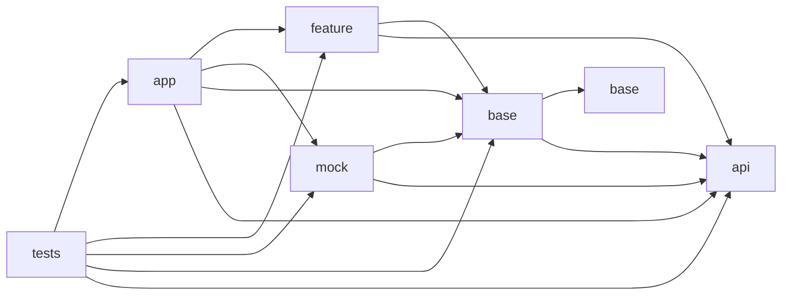

# Hive 🐝

It's the prototype of the system to verify dependencies level.<br>
I used this as a playground during my self-education in the Go language.

Right now, it can parse only the Podfile.lock file.<br>
<br>

## Details

There is an internal declaration of module types and dependency rules.

### Module Types

```go
// Can use any regexp for different platforms
map[string][]string{
  "tests":   {".*Tests$"},
  "app":     {".*Example$"},
  "mock":    {".*Mock$"},
  "feature": {},
  "base":    {},
  "api":     {".*IO$", ".*Interfaces$"},
}
```

### Dependency Rules

```go
map[string][]string{
  "tests":   {"api", "base", "feature", "mock", "app"},
  "app":     {"api", "base", "feature", "mock"},
  "mock":    {"api", "base"},
  "feature": {"api", "base"},
  "base":    {"api", "base"},
  "api":     {},
}
```



### Ignore

```yml
# Ignore module and dependency name combination by RegExp
- LocalPodIO: Kingfisher # It's for test
- .*: AnotherOneIO # It's too
```
<br>

## File Structure

```
.
├─ .devtools (Namespace)
│   └─ hive
│      ├─ modules.yml
│      └─ ignore.yml (optional)
└─ Podfile.lock
```

## Commands

There are two subcommands: `tidy` and `check`.

### Tidy

Call `tidy` to collect modules and dependencies in the first time.<br>
And then call it to sync config with the current modules.
```sh
> hive tidy
```

It will create a config file with all modules. For example:
```yml
modules:
  remote:
    Alamofire: null
    Kingfisher: null
    Moya/Core: null
    SnapKit: null
  local:
    LocalPod: null
    LocalPod/Tests: tests
    LocalPodIO: api
    LocalPodMock: mock
    LocalPodsExample: app
```

And then fill missing types manually:
```yml
modules:
  remote:
    Alamofire: base
    Kingfisher: base
    Moya/Core: base
    SnapKit: base
  local:
    LocalPod: feature
    LocalPod/Tests: tests
    LocalPodIO: api
    LocalPodMock: mock
    LocalPodsExample: app
```

<hr>

Or you can pass a path to registy with remote module types:
```sh
> hive tidy ~/Developer/Git/hive/remote/registry.yml
```

These types will be applied to remote modules in the modules.yml:
```yml
Alamofire: base
Kingfisher: base
Moya/Core: base
SnapKit: base
```

And use this command after each change of modules/dependencies/config.<br>
It will remove old modules and add new ones.

### Check

The `check` subcommand verifies local module dependencies based on default rules.
```sh
> hive check
⛔️ [api: base] LocalPodIO → Kingfisher
```
